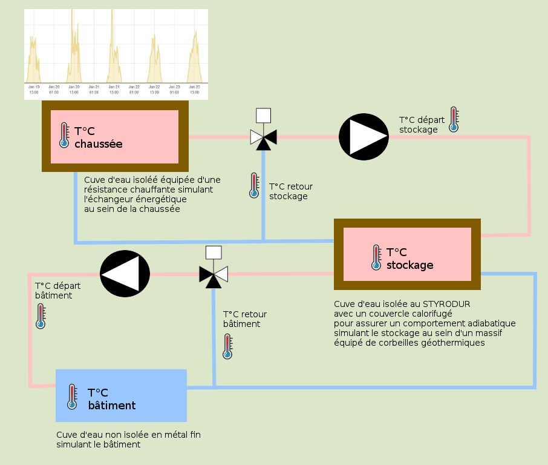

# Stage : développement logiciel sur Raspberry PI pour pilotage maquette simulant smart grid thermique

[lien vers le sujet](Cerema_stage_logiciel_automatisme.pdf)

# scale model / maquette de laboratoire

## composants achetés

achetés en 2021 : https://www.amazon.fr/gp/product/B08MTMKPQN/ref=ppx_yo_dt_b_asin_title_o00_s00?ie=UTF8&psc=1#descriptionAndDetails

[Relais 12V 220V](https://www.amazon.fr/SODIAL-R%C3%A9gulateur-Automatique-Intelligent-Anti-Transposition/dp/B07JP8TYQP/ref=sr_1_10?__mk_fr_FR=%C3%85M%C3%85%C5%BD%C3%95%C3%91&keywords=relais+carte+12V&qid=1583481978&sr=8-10)

[Module 8 relais 12V](https://www.amazon.fr/Module-Walfront-D%C3%A9clenchement-Indicateur-Traction/dp/B07JZN7GGR/ref=sr_1_3_sspa?__mk_fr_FR=%C3%85M%C3%85%C5%BD%C3%95%C3%91&keywords=relais+carte+12V&qid=1583401883&sr=8-3-spons&psc=1&spLa=ZW5jcnlwdGVkUXVhbGlmaWVyPUEyT0w5SkRMRVdWV1BOJmVuY3J5cHRlZElkPUEwMzg0MDQ5MzlSSExaOEhTRkpMVCZlbmNyeXB0ZWRBZElkPUEwMjg2MjIyM043TklaUUg2UDhFVCZ3aWRnZXROYW1lPXNwX2F0ZiZhY3Rpb249Y2xpY2tSZWRpcmVjdCZkb05vdExvZ0NsaWNrPXRydWU=)

[résistance chauffante](https://www.amazon.fr/Thermoplongeur-voyage-cuisine-r%C3%A9sistance-%C3%A9lectrique/dp/B00ISQNI5W/ref=sr_1_9?__mk_fr_FR=%C3%85M%C3%85%C5%BD%C3%95%C3%91&keywords=thermoplongeur&qid=1583482478&sr=8-9)

(x3) [pompe DN15 - DN15 male – DN15 male](https://www.amazon.fr/Prom-near-balais-c%C3%A9ramique-r%C3%A9sistante-temp%C3%A9rature/dp/B07FJP2N3R?ref_=s9_apbd_orecs_hd_bw_b21XDqB&pf_rd_r=PMZV60FX5ZNNHX5PZBSJ&pf_rd_p=54aab920-59f6-583d-aa8a-1b96cc3982eb&pf_rd_s=merchandised-search-10&pf_rd_t=BROWSE&pf_rd_i=1854960031)

(x6) [Raccord DN15 femelle – DN20 male](https://www.amazon.fr/Wolfpack-4020087-R%C3%A9duction-Hexagonal-femelle/dp/B0160DG6XU/ref=sr_1_5?__mk_fr_FR=%C3%85M%C3%85%C5%BD%C3%95%C3%91&keywords=1%2F2+3%2F4&qid=1583487591&sr=8-5)

(x3) [Vanne 3 voie motorisée DN20](https://www.amazon.fr/vanne-voies-motoris%C3%A9e-electrovanne-bille/dp/B07GCGSPVJ/ref=sr_1_5?keywords=vanne%2B3%2Bvoies%2Bmotoris%C3%A9e&qid=1582276603&sr=8-5&th=1)

(x4) [débit mètre DN20 - F = [8.1Q-5] ± 10%, F val. inst. impul. (Hz), Q flux instantané](https://www.amazon.fr/Be82aene-Capteur-dimpulsion-1-75Mpa-D%C3%A9bitm%C3%A8tres/dp/B083DKQF2H/ref=sr_1_6?__mk_fr_FR=%C3%85M%C3%85%C5%BD%C3%95%C3%91&keywords=debitmetre+dn20&qid=1583421058&sr=8-6)

### temperature asset measurement (road, building, storage)

(x8) [PT100 2mètres](https://www.amazon.fr/Sonde-inoxydable-thermistance-capteur-temperature/dp/B01CNMAQS8/ref=pd_bxgy_img_2/262-9971649-2446628?_encoding=UTF8&pd_rd_i=B01CNMAQS8&pd_rd_r=b3596105-8191-4db1-9e38-9227a4d0a3aa&pd_rd_w=Y9V93&pd_rd_wg=Rbsei&pf_rd_p=da1675de-3974-4ba2-b26f-c06b987f79cb&pf_rd_r=H16ES3JDRVQPR8407678&psc=1&refRID=H16ES3JDRVQPR8407678)

### temperature fluid measurement

(x6) [Té 3 embouts femelles 3/4](https://www.amazon.fr/Watts-Raccord-laiton-visser-Femelle/dp/B079HWNM8V/ref=pd_sbs_60_3/257-2633906-0516104?_encoding=UTF8&pd_rd_i=B079HWNM8V&pd_rd_r=71a1e942-763d-41cf-8dd3-9377115e6ffc&pd_rd_w=hQLsT&pd_rd_wg=ga5Ut&pf_rd_p=72159c7a-2bb2-4a15-aa35-b315ce8f5c64&pf_rd_r=N8SHPHFVS4NKSSWWZTDZ&psc=1&refRID=N8SHPHFVS4NKSSWWZTDZ)

[raccord male male 3/4 x10](https://www.amazon.fr/Lot-connecteurs-m%C3%A2les-laiton-R%C3%A9ducteur/dp/B07N6FJKVG/ref=sr_1_8?__mk_fr_FR=%C3%85M%C3%85%C5%BD%C3%95%C3%91&keywords=3%2F4+male+male&qid=1583489448&sr=8-8)

(only x4 for the scale model - 2 in spare)(x6) [PT100 doigt de gant 30mm / 3/4" male](https://www.amazon.fr/Maslin-Capteur-Temp%C3%A9rature-Filetage-Inoxydable/dp/B07KDJ2V6V/ref=sr_1_2?__mk_fr_FR=%C3%85M%C3%85%C5%BD%C3%95%C3%91&keywords=sonde%2Bpt100%2B3%2F4&qid=1583400770&sr=8-2&th=1)

(x2) [Té 3 embouts DN20 male x3](https://www.amazon.fr/Watts-Raccord-laiton-visser-Laiton/dp/B079HTX7Q4/ref=pd_sbs_60_2/257-2633906-0516104?_encoding=UTF8&pd_rd_i=B079HTX7Q4&pd_rd_r=61592a83-524d-40de-983a-b9562a1d47a5&pd_rd_w=3UHBD&pd_rd_wg=vhdZk&pf_rd_p=72159c7a-2bb2-4a15-aa35-b315ce8f5c64&pf_rd_r=M2HFP0G0AV330J89NPMR&psc=1&refRID=M2HFP0G0AV330J89NPMR)

(x8) [raccord caisse plastique](https://www.amazon.fr/Boutt%C3%A9-2147517-TC20-Travers%C3%A9e-laiton/dp/B00GOYYS0E/ref=pd_sbs_60_t_1/262-9971649-2446628?_encoding=UTF8&pd_rd_i=B00GOYYS0E&pd_rd_r=d6ef660b-0bb2-4220-9331-78c68bf6fde3&pd_rd_w=CTfqf&pd_rd_wg=gUoyO&pf_rd_p=9b28d941-c13a-4c2b-b935-36854aa20020&pf_rd_r=STKBVJFQPYAJE4RE6DEJ&psc=1&refRID=STKBVJFQPYAJE4RE6DEJ)

[tuyau 19mm au mètre (10m)](https://www.amazon.fr/FlexTube-pouces-flexible-pression-aliments/dp/B07B4GRH2F/ref=sr_1_12?__mk_fr_FR=%C3%85M%C3%85%C5%BD%C3%95%C3%91&keywords=tuyau+19mm&qid=1583489791&sr=8-12)

(2 x20) [raccord coupleur tétine tuyau x20 DN20 femelle](https://www.amazon.fr/G%C3%A9n%C3%A9rique-Barbillon-Raccord-Coupleur-femelle/dp/B00WG8XR90/ref=sr_1_28?__mk_fr_FR=%C3%85M%C3%85%C5%BD%C3%95%C3%91&keywords=coupleur+3%2F4+3%2F4&qid=1583488174&sr=8-28)

(3 x12) [collier de serrage x12](https://www.amazon.fr/Collier-Serrage-Ajustable-Inoxydable-Fixation/dp/B07D6L2PNT/ref=sr_1_33?__mk_fr_FR=%C3%85M%C3%85%C5%BD%C3%95%C3%91&keywords=collier+20mm&qid=1583489935&sr=8-33)

[caisse plastique](https://www.amazon.fr/Sundis-4501001-Rangement-Couvercle-Transparent/dp/B01I94TXU6/ref=sr_1_12?__mk_fr_FR=%C3%85M%C3%85%C5%BD%C3%95%C3%91&keywords=caisse+plastique&qid=1583498327&sr=8-12)

(8 x5) [collier de fixation x5](https://www.amazon.fr/Boutt%C3%A9-3373168-Colliers-fixation-simple/dp/B00J9C6QSU/ref=sr_1_8?__mk_fr_FR=%C3%85M%C3%85%C5%BD%C3%95%C3%91&keywords=collier+fixation+25&qid=1583498781&s=hi&sr=1-8)

## options (non commandées)

[compteur eau chaude DN20 (1 impulsion=0,25litre)](https://www.manomano.fr/p/compteur-deau-chaude-avec-sortie-impulsion-1-imp-025-litre-2663411)

[Manchon taraudé Femelle/Femelle avec butée centrale en laiton - Ø 3/4 pouce](https://www.amazon.fr/Ezfitt-Manchon-taraud%C3%A9-Femelle-centrale/dp/B079NGD3LF/ref=sr_1_20?__mk_fr_FR=%C3%85M%C3%85%C5%BD%C3%95%C3%91&keywords=3%2F4+femelle+femelle&qid=1583486189&sr=8-20)

# pilotage

http://sarakha63-domotique.fr/jeedom-domotiser-une-vanne-3-voies/

https://www.abcclim.net/regulation-p-pi-pid.html

http://www.ferdinandpiette.com/blog/2011/08/implementer-un-pid-sans-faire-de-calculs/

[doc sur les régulateurs P, PI et PID](regulateurs_standards.pdf)

# culture G

[vers la maison passive](https://trystanlea.org.uk/)
