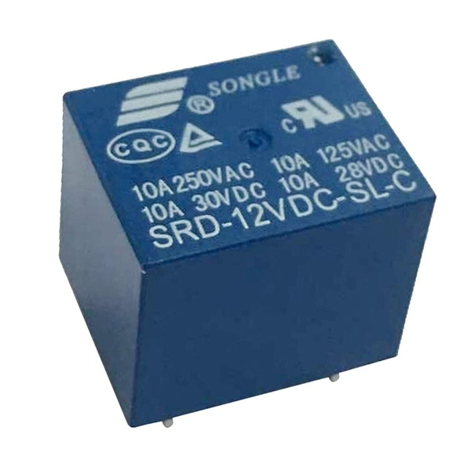
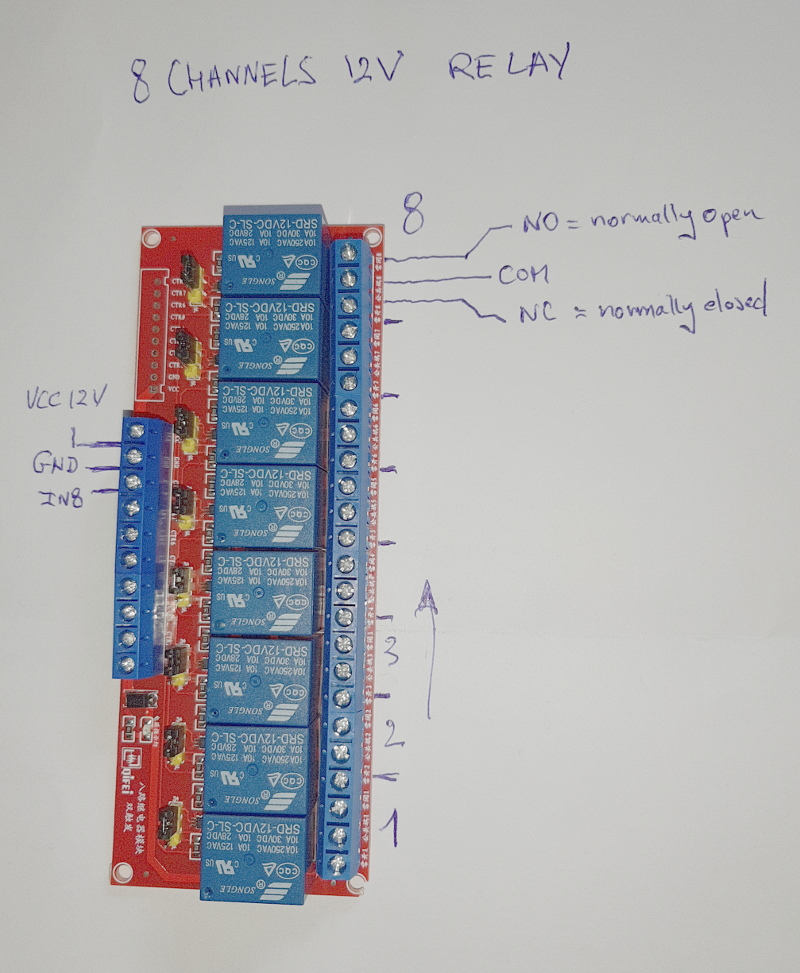
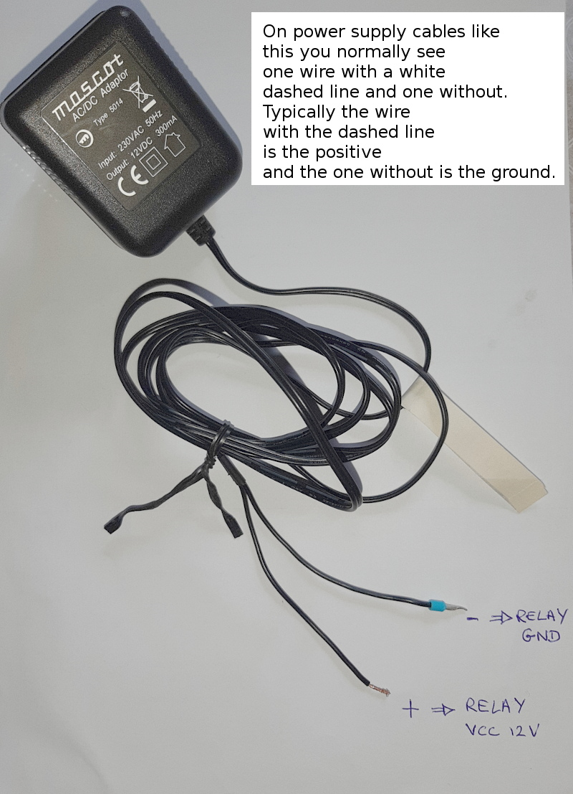
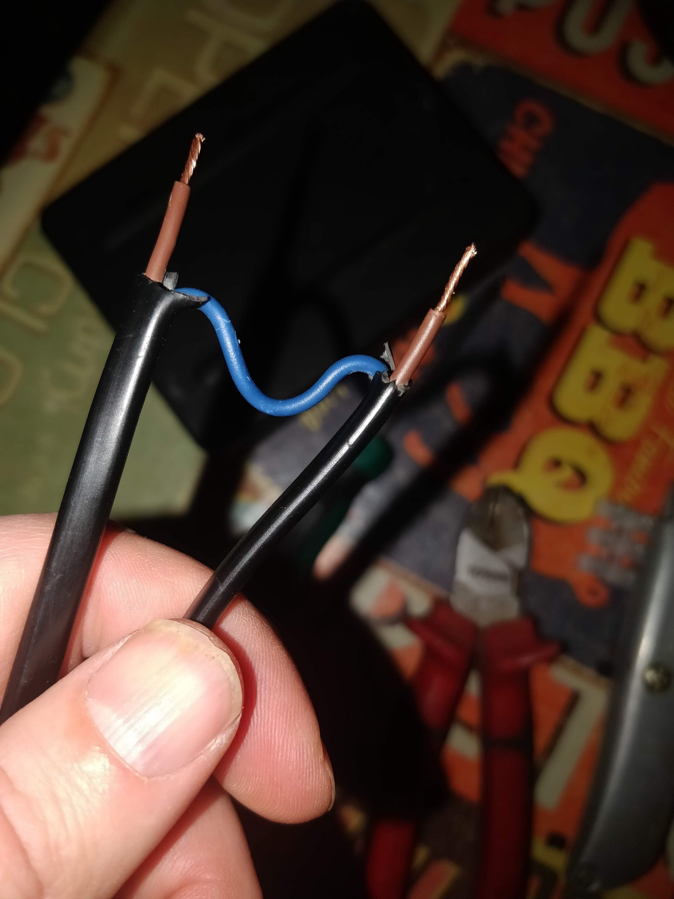
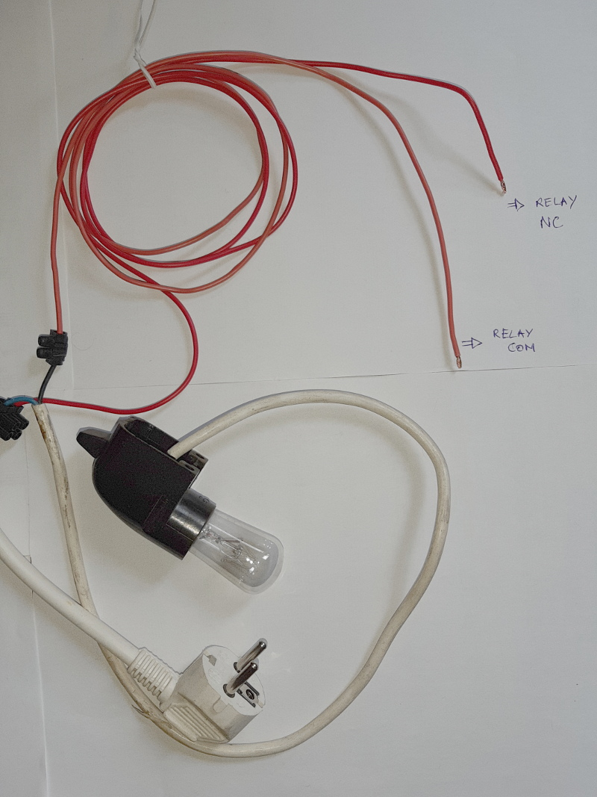
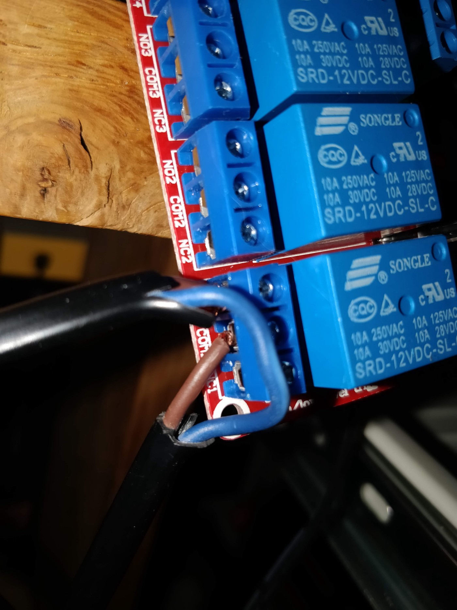
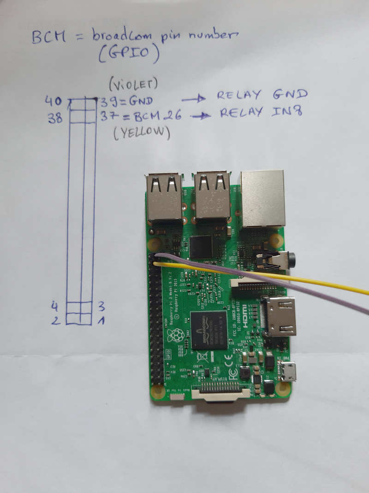

# how to operate relays

On peut également deviner que le relais s’alimente et se commande en 12V (SRD-12VDC-SL-C)

On peut lire dessus qu’on peut faire passer :

- 10 ampères sous 250V alternatif (50 ou 60Hz), c’est-à-dire du secteur en France.
- 10 ampères sous 125V alternatif (50 ou 60Hz), c’est-à-dire environ 1KW pour les pays en 110V. 
- 10 ampères en 28 ou 30V continu.

Cela permet de commander un appareil jusqu’à environ 2KW, soit une ampoule ou un radiateur. 

Attention aux moteurs qui ont souvent un très fort appel de courant au démarrage :

- Impossible de brancher la machine à laver ou le frigo sur ce genre de relais. 
- Il semble possible de contrôler un ventilateur dont le moteur fait quelques dizaine de watt.

## relays

## equipement to control

## raspberry control

To check pinout on the raspberry : https://pinout.xyz/#

