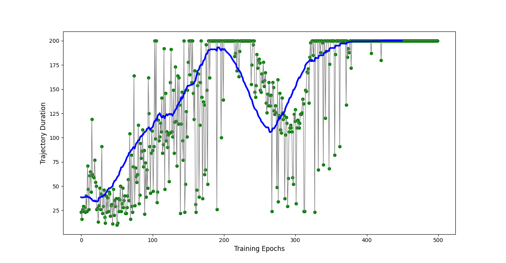

https://adventuresinmachinelearning.com/

https://github.com/adventuresinML/adventures-in-ml-code

https://adventuresinmachinelearning.com/reinforcement-learning-tensorflow/

https://torres.ai/deep-reinforcement-learning-explained-series/

https://github.com/jorditorresBCN/Deep-Reinforcement-Learning-Explained/blob/master/DRL_15_16_17_DQN_Pong.ipynb

https://github.com/Shmuma/Deep-Reinforcement-Learning-Hands-On

# RL libraries

https://github.com/facebookresearch/rl

https://github.com/ray-project/ray/tree/master/rllib/agents

https://stable-baselines.readthedocs.io/en/master/

TensorFlow vs PyTorch : https://medium.com/data-science-at-microsoft/a-tale-of-two-frameworks-pytorch-vs-tensorflow-f73a975e733d

# Double DQN

https://towardsdatascience.com/double-deep-q-networks-905dd8325412

https://adgefficiency.com/dqn-tuning/

double Q learning - Van Hasselt - 2010 - https://proceedings.neurips.cc/paper/2010/file/091d584fced301b442654dd8c23b3fc9-Paper.pdf

double DQN - Van Hasselt - 2016 - https://arxiv.org/pdf/1509.06461.pdf

https://hadovanhasselt.com/

https://www.researchgate.net/profile/Hado-Van-Hasselt

fujimoto : https://arxiv.org/pdf/1802.09477.pdf

https://slazebni.cs.illinois.edu/spring17/lec17_rl.pdf

https://www.davidsilver.uk/wp-content/uploads/2020/03/rainbow.pdf

Dueling : http://proceedings.mlr.press/v48/wangf16.pdf or https://arxiv.org/pdf/1511.06581.pdf

# people

## David Silver @ deepmind

https://www.davidsilver.uk/

les diapos du cours : https://www.davidsilver.uk/teaching/ 

##  John Schulman @ openai

http://joschu.net/index.html

https://www.youtube.com/watch?v=aUrX-rP_ss4

http://rl-gym-doc.s3-website-us-west-2.amazonaws.com/mlss/2016-MLSS-RL.pdf

# Reinforce and policy gradient

## training an agent to play gym cartpole v0

using tensorflow in [reinforce_tf.py](reinforce_tf.py)

## on the web

https://ai.stackexchange.com/questions/11929/how-is-the-policy-gradient-calculated-in-reinforce

https://github.com/pytorch/examples/blob/main/reinforcement_learning/reinforce.py

https://github.com/dennybritz/reinforcement-learning/blob/master/PolicyGradient/CliffWalk%20REINFORCE%20with%20Baseline%20Solution.ipynb

https://github.com/dennybritz/reinforcement-learning/blob/master/lib/envs/cliff_walking.py

deterministic policy gradients : http://proceedings.mlr.press/v32/silver14.pdf

https://github.com/aniket-gupta1/Reinforcement_Learning/blob/master/Policy_Optimization_methods/VPG/Iteration1_VPG.py

https://medium.com/swlh/cartpole-with-policy-gradient-tensorflow-2-x-3a7a14b9cc03

https://github.com/RahulBarman101/Policy-Gradient-CartPole-PyTorch/blob/master/policy_gradient_pytorch.py

## DDPG - deep deterministic policy gradients

https://paperswithcode.com/method/d4pg

continuous policy gradients : https://towardsdatascience.com/a-minimal-working-example-for-continuous-policy-gradients-in-tensorflow-2-0-d3413ec38c6b

https://arxiv.org/pdf/1509.02971v6.pdf

# en interaction avec le monde réel

https://github.com/vishwamano/Data-center-cooling-controller-using-Artificial-intelligence

https://deepmind.com/blog/article/deepmind-ai-reduces-google-data-centre-cooling-bill-40

https://github.com/mojopoly/minimize-costs-datacenter

https://towardsdatascience.com/a-non-trivial-elevator-control-system-in-a-train-station-by-reinforcement-learning-f37e00137172

# deepmind

https://github.com/deepmind/alphafold

https://github.com/tensorflow/minigo

https://github.com/brilee/MuGo

https://coral.ai/examples/

# pseudocodes

