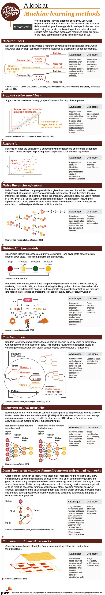

https://github.com/kamenbliznashki/sutton_barto/blob/master/ch13_corridor_gridworld.py

https://www.quora.com/What-are-some-machine-learning-algorithms-that-you-should-always-have-a-strong-understanding-of-and-why/answer/Tosho-Trajanov?ch=15&oid=40183993&share=50ab257b&target_type=answer

Machine learning summer school : http://mlss.cc/

